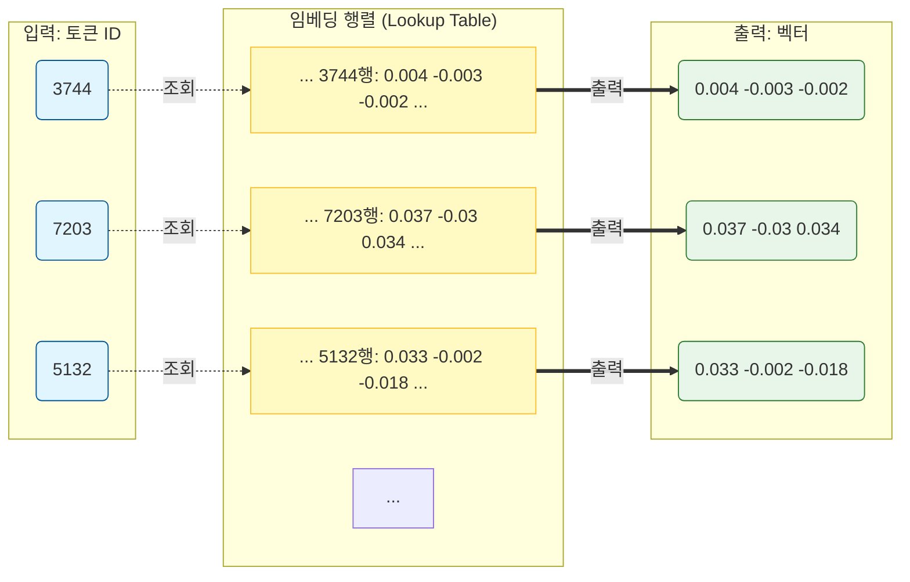

# 행렬 곱셈으로 어텐션(Attention) 계산하기

이 글에서는 **스케일된 내적 어텐션(Scaled Dot-Product Attention)** 을 수식 → 행렬 크기 → 단계별 연산 → 3×3 숫자 예시 순으로만 다룹니다. 트랜스포머의 어텐션은 전부 행렬 곱셈과 softmax로 이루어지므로, 이 흐름만 따라가면 구현이 그대로 보입니다.

**전체 흐름도**  
문장부터 어텐션 출력까지의 단계는 아래와 같습니다.

```
  문장  →  토크나이저  →  ID  →  임베딩 층  →  X  →  Q,K,V  →  QK^T → 스케일 → softmax → A  →  A×V  →  출력
         [최근,사드,배치] [3744,7203,5132]   (행 조회)  (벡터 행렬)  (X×W_Q 등)                    (가중치)
```

**차례**

1. 쿼리·키·값이란?
2. 수식 한 줄
3. 행렬 크기 정리
4. 단계별 행렬 연산
5. 한 번에 쓰면
6. 실제 계산 예시
7. 마스킹(Masking)은 어디서 일어나나요? (디코더 어텐션의 경우)
8. 멀티헤드 어텐션(Multi-head)으로 확장하려면 어떻게 하나요?
9. 숫자 예시 (작게)
10. Python으로 확인하기
11. BERT와의 관계
12. 참고

---

## 쿼리·키·값이란?

**Query(쿼리)** 는 "지금 이 위치를 이해하려면 어떤 위치에 주목해야 할까?"를 묻는 벡터이고, **Key(키)** 는 "각 위치가 자신을 얼마나 중요하게 소개하는지"를 나타내는 벡터입니다. **Value(값)** 는 실제로 가져와서 섞을 정보를 담은 벡터입니다. 쿼리와 키로 "누구에게 얼마나 주목할지" 점수를 내고, 그 점수를 비율(가중치)로 바꾼 뒤 값들을 그 비율대로 섞어서 출력을 만듭니다. 그래서 **주목할 대상을 고르는 역할(Q, K)**과 **가져올 정보(V)** 를 나누어 세 가지를 쓰는 것입니다.

실제 모델에서는 입력 임베딩 \(X\)에 대해 \(Q = X W_Q\), \(K = X W_K\), \(V = X W_V\)처럼 **학습 가능한 행렬** 로 곱해 Q, K, V를 만듭니다. 아래에서는 이미 만들어진 \(Q, K, V\)가 주어졌다고 보고 행렬 연산만 다룹니다.

---

## 수식 한 줄

$$
\mathrm{Attention}(Q, K, V) = \mathrm{softmax}\left(\frac{QK^T}{\sqrt{d_k}}\right) V
$$

- **Q**: 쿼리 행렬  
- **K**: 키 행렬  
- **V**: 값 행렬  
- **d_k**: 키(및 쿼리) 벡터의 차원

---

## 행렬 크기 정리

시퀀스 길이(위치 개수)를 **n**, 키/값이 있는 위치 개수를 **m**이라고 하면:

| 행렬 | 크기 | 설명 |
|------|------|------|
| **Q** | n × d_k | 쿼리 n개, 한 행이 한 위치의 쿼리 |
| **K** | m × d_k | 키 m개, 한 행이 한 위치의 키 |
| **V** | m × d_v | 값 m개, 한 행이 한 위치의 값 |

**셀프 어텐션**에서는 같은 시퀀스를 Q, K, V 모두에 쓰므로 **n = m** (예: 문장 길이 **L**)이고, 보통 **d_v = d_k**로 둡니다. **인코더-디코더 어텐션**에서는 쿼리만 디코더에서, 키·값은 인코더에서 오므로 쿼리 개수 **n**과 키/값 위치 개수 **m**이 다를 수 있습니다 (**n ≠ m**).

---

## 단계별 행렬 연산

### 1.단계: \(Q K^T\)

- \(Q\): \((n \times d_k)\), \(K^T\): \((d_k \times m)\)
- 곱: \((n \times d_k)(d_k \times m) = n \times m\)
- \((i,j)\) 성분 = \(i\)번째 쿼리와 \(j\)번째 키의 **내적** → "위치 \(i\)가 위치 \(j\)에 주목하는 정도"의 점수

### 2.단계: \(\sqrt{d_k}\)로 나누기

- 행렬의 모든 원소를 \(\sqrt{d_k}\)로 나눔
- 크기는 그대로 \((n \times m)\)
- **이유:** \(d_k\)가 크면 내적이 \(d_k\)개 항의 합이라 점수 분산이 커집니다. 그대로 softmax에 넣으면 입력이 너무 커져서 기울기가 거의 0에 가까운 구간으로 가고, 학습이 잘 되지 않습니다. \(\sqrt{d_k}\)로 나누면 점수 분산이 대략 1에 가깝게 유지되어 softmax가 적당한 구간에서 동작합니다.

### 3.단계: 행별 softmax

- 위 \((n \times m)\) 행렬의 **각 행**에 softmax 적용
- 한 행 = 한 쿼리에 대한 모든 키에 대한 점수 → 행별로 합이 1인 **어텐션 가중치 행렬** \(A\)
- \(A\) 크기: \((n \times m)\)

### 4.단계: \(A V\)

- \(A\): \((n \times m)\), \(V\): \((m \times d_v)\)
- 곱: \((n \times m)(m \times d_v) = n \times d_v\)
- 출력의 \(i\)번째 행 = \(i\)번째 쿼리에 대한 **값 벡터들의 가중합** → 어텐션 최종 출력

---

## 한 번에 쓰면

$$
\underbrace{\mathrm{softmax}\left(\frac{QK^T}{\sqrt{d_k}}\right)}_{(n \times m)\ \text{가중치}} \cdot \underbrace{V}_{(m \times d_v)} = \underbrace{\text{출력}}_{(n \times d_v)}
$$

중간에 나오는 \((n \times m)\) 행렬이 "어느 위치가 어느 위치를 얼마나 보는지"이고, 이걸로 \(V\)를 섞어서 \((n \times d_v)\) 출력을 만듭니다.

---

## 실제 계산 예시

아래는 **셀프 어텐션** 예시입니다. 같은 시퀀스를 Q, K, V 모두에 쓰므로 쿼리 개수 n과 키/값 위치 개수 m이 같습니다 (n = m).

설정: 쿼리 개수 n = 3, 키/값 위치 개수 m = 3, 차원 d_k = d_v = 3.

---

### 문장 → 토크나이징 → 임베딩

예시 "최근 사드 배치 때문에 한중 관계가 악화되면서 많은 중국인들이 불안해하고 있다."
전체 문장을 쓰면 토큰이 많아지므로, **앞 3개 토큰만** 사용해 시뮬레이션합니다.

- **입력 문장 (일부):** "최근 사드 배치 때문에 …"

**토크나이저를 통한 ID 변환:** 토크나이저(BPE·WordPiece 등)가 문장을 받으면, 먼저 문자열을 토큰(단어 또는 서브워드) 열로 나눕니다. 그다음 미리 정해진 **어휘(vocabulary)**에서 각 토큰에 대응하는 **정수 ID**를 찾아 넣습니다. 즉, 문장 → 토큰 열 → (어휘 조회) → ID 열 순서입니다.

- **토크나이저 출력 (시뮬레이션):** 토큰 = [최근, 사드, 배치], 토큰 ID = [1024, 2047, 3512]

아래 코드는 **BPE·WordPiece** 토크나이저(예: BERT용)를 써서 **문장 → 토크나이징 → ID → 임베딩**까지 구현한 예시입니다. 
`uv run --with numpy --with transformers python3` 등으로 실행하면 아래 실행 결과와 동일하게 나옵니다.

```python
import numpy as np
from transformers import AutoTokenizer

# 재현을 위해 시드 고정 (아래 표·숫자 예시와 동일)
np.random.seed(42)

tokenizer = AutoTokenizer.from_pretrained("klue/bert-base")
text = "최근 사드 배치 때문에 한중 관계가 악화되면서 많은 중국인들이 불안해하고 있다."
tokens = tokenizer.tokenize(text)
input_ids = tokenizer.convert_tokens_to_ids(tokens)
tokens = tokens[:3]
input_ids = np.array(input_ids[:3])

print("토큰:", tokens)
print("ID:", input_ids.tolist())

vocab_size = tokenizer.vocab_size
d_model = 3
emb_table = np.random.randn(vocab_size, d_model) * 0.02
X = emb_table[input_ids]
print("임베딩 조회 결과 X:\n", X)
```

**실행 결과 (예제 코드 실행 시 동일):**

```
토큰: ['최근', '사드', '배치']
ID: [3744, 7203, 5132]

임베딩 조회 결과 X:
 [[ 0.00385238 -0.00288    -0.00188545]
 [ 0.03708048 -0.03048718  0.0339122 ]
 [ 0.03303278 -0.00240544 -0.01844049]]
```

**이 출력이 “임베딩”인가?**  
`emb_table[input_ids]`로 **ID를 인덱스로 행을 조회**해 얻은 벡터가 임베딩 층 출력입니다. 위 값은 `np.random.seed(42)`로 재현한 **실제 조회 결과**이며, 학습된 BERT처럼 0/1이 아닌 밀집 실수 벡터입니다. 아래 표와 수식은 이 예제 실행 결과와 동일한 숫자를 사용합니다.

**임베딩 층 동작 원리**  
임베딩 층은 **ID를 인덱스로 써서 행렬에서 벡터를 꺼내오는(Lookup)** 과정입니다.



**설명:**
1. 입력으로 단어 **최근**에 해당하는 정수 ID가 들어옵니다(예: 3744).
2. 임베딩 행렬에서 그 ID번째 행을 찾아갑니다.
3. 그 행에 있는 값 **[0.004, -0.003, -0.002]**를 그대로 출력 벡터로 내보냅니다.
(**사드**, **배치**에 해당하는 ID도 마찬가지로 해당 행을 조회합니다.)

이 과정을 통해 나온 세 벡터를 합치면 아래 표와 같은 **임베딩 층 출력 X**가 됩니다.

| 토큰 | 차원1 | 차원2 | 차원3 |
|---|-----|-----|-----|
| 최근 | 0.004 | -0.003 | -0.002 |
| 사드 | 0.037 | -0.030 | 0.034 |
| 배치 | 0.033 | -0.002 | -0.018 |

이 벡터들을 모은 행렬을 **임베딩 행렬 X** (크기 3×3)라고 합니다. 실제 모델에서는 임베딩 행렬이 학습됩니다.

---

### 입력: Q, K, V (임베딩에서 만들기)

실제 모델에서는 **입력(임베딩 행렬 X)**v 에 **가중치 행렬 W_Q, W_K, W_V** 를 곱해 Q, K, V를 만듭니다. 수식은 **Q = X × W_Q**, **K = X × W_K**, **V = X × W_V** 입니다. 아래에서는 **입력 벡터** 와 **가중치 행렬** 을 나누어 두고, 그 곱(×)으로 Q, K, V를 얻습니다.

**1) 입력 벡터 (임베딩 행렬 X)**  
위 "토크나이징 → 임베딩"에서 쓴 것과 동일합니다. 크기 3×3, 한 행이 한 토큰의 임베딩 벡터입니다.

| 토큰 | 열1 | 열2 | 열3 |
|---|-----|-----|-----|
| **X** (입력) | | | |
| 최근 | 0.004 | -0.003 | -0.002 |
| 사드 | 0.037 | -0.030 | 0.034 |
| 배치 | 0.033 | -0.002 | -0.018 |

**2) 가중치 행렬 W_Q, W_K, W_V**  
학습 가능한 파라미터이며, 실제 모델에서는 **보통 작은 랜덤 값**으로 초기화합니다. 아래는 `np.random.seed(43)`으로 재현한 예시입니다.

| | 열1 | 열2 | 열3 |
|---|-----|-----|-----|
| **W_Q** (쿼리 변환) | | | |
| 행1 | 0.515 | -1.817 | -0.757 |
| 행2 | -1.070 | 1.716 | -0.826 |
| 행3 | 0.996 | 4.020 | 2.526 |

| | 열1 | 열2 | 열3 |
|---|-----|-----|-----|
| **W_K** (키 변환) | | | |
| 행1 | -0.878 | -0.693 | 0.911 |
| 행2 | -3.337 | -1.724 | 0.986 |
| 행3 | -0.249 | 3.870 | -1.237 |

| | 열1 | 열2 | 열3 |
|---|-----|-----|-----|
| **W_V** (값 변환) | | | |
| 행1 | -2.094 | -1.779 | 0.028 |
| 행2 | -0.322 | 4.461 | -0.798 |
| 행3 | 0.109 | 1.768 | -0.216 |

**3) 결과: Q = X × W_Q, K = X × W_K, V = X × W_V**  
입력 X에 각 가중치를 곱한 결과입니다. (3×3) × (3×3) = (3×3).

| 토큰 | 열1 | 열2 | 열3 |
|---|-----|-----|-----|
| **Q** (쿼리) | | | |
| 최근 | 0.0032 | -0.0195 | -0.0053 |
| 사드 | 0.0855 | 0.0166 | 0.0828 |
| 배치 | 0.0012 | -0.1383 | -0.0696 |

| 토큰 | 열1 | 열2 | 열3 |
|---|-----|-----|-----|
| **K** (키) | | | |
| 최근 | 0.0067 | -0.0050 | 0.0030 |
| 사드 | 0.0607 | 0.1581 | -0.0382 |
| 배치 | -0.0164 | -0.0901 | 0.0505 |

| 토큰 | 열1 | 열2 | 열3 |
|---|-----|-----|-----|
| **V** (값) | | | |
| 최근 | -0.0073 | -0.0230 | 0.0028 |
| 사드 | -0.0641 | -0.1420 | 0.0181 |
| 배치 | -0.0704 | -0.1021 | 0.0068 |

정리하면, **입력 X**와 **가중치 W_Q, W_K, W_V**를 각각 둔 뒤 **X × W_Q → Q**, **X × W_K → K**, **X × W_V → V**를 계산하고, 이 Q, K, V로 아래 단계별 어텐션 연산을 적용합니다.

---

### 1단계: \(Q K^T\) (쿼리·키 내적 → 점수)

**의미:** (i,j) = "**토큰 i** 쿼리가 **토큰 j** 키에 주는 점수". \(Q K^T\)의 (i,j) = \(i\)행과 \(j\)행의 내적.

| 쿼리 \ 키 | 최근 | 사드 | 배치 |
|---|-----|-----|-----|
| 최근 | 0.0001 | -0.0016 | 0.0008 |
| 사드 | 0.0004 | 0.0027 | 0.0007 |
| 배치 | 0.0003 | -0.0110 | 0.0052 |

---

### 2단계: \(\sqrt{d_k}\)로 나누기

**의미:** 점수를 \(\sqrt{d_k} = \sqrt{3} \approx 1.732\)로 나눠 softmax가 포화되지 않게 함.

| 쿼리 \ 키 | 최근 | 사드 | 배치 |
|---|-----|-----|-----|
| 최근 | 0.00006 | -0.0009 | 0.0005 |
| 사드 | 0.0002 | 0.0016 | 0.0004 |
| 배치 | 0.0002 | -0.0064 | 0.0030 |

---

### 3단계: 행별 softmax → 어텐션 가중치 \(A\)

**의미:** 각 행을 "합이 1"이 되도록 softmax로 비율로 바꾼다. 한 행 = **그 토큰이 다른 토큰들을 얼마나 볼지**.

점수 값들이 비슷하면 softmax 후 가중치가 비슷하게 나온다. (랜덤 W로 만든 Q, K라서 \(QK^T/\sqrt{d_k}\)가 작고, 행별로 비슷하면 가중치가 약 1/3에 가깝다.)

| 쿼리 \ 키 | 최근 | 사드 | 배치 | 행 합 |
|---|-----|-----|-----|-------|
| 최근 | 0.333 | 0.333 | 0.334 | 1 |
| 사드 | 0.333 | 0.334 | 0.333 | 1 |
| 배치 | 0.334 | 0.330 | 0.336 | 1 |

---

### 4단계: \(A V\) → 최종 출력

**의미:** 가중치 \(A\)로 값 \(V\)를 섞는다. 출력의 \(i\)행 = **그 단어가 "본" 문맥 정보**(다른 단어 값들의 가중합). \(A\)가 거의 균등하면 출력 행들이 비슷해진다.

| 토큰 | 차원1 | 차원2 | 차원3 |
|---|--------|--------|--------|
| 최근 | -0.047 | -0.089 | 0.009 |
| 사드 | -0.047 | -0.089 | 0.009 |
| 배치 | -0.047 | -0.089 | 0.009 |

**정리:** 각 토큰이 "최근·사드·배치" 셋의 정보를 가중치대로 섞어서 새로운 벡터(위 표 한 행)를 얻는다. 크기는 (3 × 3) = (n × d_v)이다.

---

## 마스킹(Masking)은 어디서 일어나나요? (디코더 어텐션의 경우)

마스킹은 **스케일된 내적 어텐션 안에서**, **softmax를 쓰기 직전**에 적용됩니다. 즉, 1·2단계로 구한 점수 행렬( QK^T / sqrt(d_k) )의 **일부 원소를 마스크 값(보통 -∞)으로 덮어쓴 뒤**, 그 행렬에 행별 softmax를 적용합니다.

**디코더 셀프 어텐션**에서는 "현재 위치보다 뒤에 있는 위치"를 보면 안 되므로, (i, j)에서 j > i 인 칸을 마스킹합니다. 예를 들어 위치 3의 쿼리는 위치 1, 2만 볼 수 있고 위치 4는 볼 수 없습니다. 점수 행렬에서 "못 보는 칸"을 -∞로 두면, softmax 후 그 칸의 가중치는 0이 되어 정보가 섞이지 않습니다. 정리하면, **마스킹이 일어나는 곳 = 점수 행렬에 마스크를 씌운 뒤, 그 결과에 softmax를 적용하는 단계**입니다 (위 단계별 연산 기준으로는 2단계와 3단계 사이).

---

## 멀티헤드 어텐션(Multi-head)으로 확장하려면 어떻게 하나요?

**한 번에 한 가지 어텐션만 쓰는 대신**, Q, K, V를 서로 다른 **학습 가능한 선형 변환**으로 h번 곱해서(각 헤드마다 다른 변환), 같은 수식(스케일된 내적 어텐션)을 h번 병렬로 돌린 뒤, 결과를 이어 붙이고 다시 한 번 선형 변환하는 방식입니다.

1. **입력:** 인코더/디코더에서 나온 표현 행렬 (길이 n, 차원 d_model).
2. **헤드별 변환:** Q, K, V를 각각 h개의 서로 다른 행렬 W_Q^l, W_K^l, W_V^l (l = 1,…,h)로 곱해, 헤드 l마다 Q_l, K_l, V_l (크기 n × d_k, 보통 d_k = d_model / h)를 만듭니다.
3. **헤드별 어텐션:** 각 l에 대해 위에서 다룬 것처럼 Attention(Q_l, K_l, V_l)을 계산합니다. 출력은 n × d_v (보통 d_v = d_k).
4. **이어 붙이기:** h개의 n × d_v 출력을 열 방향으로 이어 붙여 n × (h·d_v) = n × d_model 행렬을 만듭니다.
5. **최종 변환:** 이 행렬에 한 번 더 선형 변환(및 필요하면 잔차 연결·레이어 노름)을 적용해 최종 멀티헤드 어텐션 출력을 얻습니다.

즉, **단일 헤드**는 "Q, K, V 한 세트 → 한 번의 스케일된 내적 어텐션 → 출력 한 개"이고, **멀티헤드**는 "Q, K, V를 h가지 선형 변환으로 곱해 h세트 만들기 → 같은 어텐션을 h번 → h개 출력을 concat → 한 번 더 선형 변환"으로 확장하면 됩니다.

---

## 숫자 예시 (작게)

\(n = m = 4\), \(d_k = d_v = 4\)로 두고 크기만 확인해 보면:

- \(Q\): 4×4  
- \(K\): 4×4 → \(K^T\): 4×4  
- \(Q K^T\): 4×4 (각 행이 한 쿼리의 키별 점수)  
- 스케일·softmax 후 \(A\): 4×4 (행별 합 1)  
- \(V\): 4×4  
- \(A V\): 4×4 → **출력 4개 위치 × 차원 4**

실제 값까지 넣어서 계산해 보려면, 위 "실제 계산 예시"처럼 작은 \(Q,K,V\)를 정한 뒤 \(Q K^T\) → 스케일 → 행별 softmax → \(A V\) 순서로 하면 된다. 아래 Python 예제는 위 3×3 예시와 동일한 입력으로 같은 결과를 낸 뒤, \(n=4,\,d_k=d_v=8\)인 경우도 함께 다룬다.

---

## Python으로 확인하기

아래 코드는 **(1) 토크나이저와 임베딩**, **(2) 어텐션 계산**을 클래스 형태로 구현해 전체 과정을 보여줍니다. `transformers` 라이브러리 없이도 동작 원리를 이해할 수 있도록 NumPy로 작성했습니다.

```python
import numpy as np

# ---------------------------------------------------------
# 1. 토크나이저 & 임베딩 (문장 -> ID -> 벡터)
# ---------------------------------------------------------
class SimpleTokenizer:
    def __init__(self):
        # 예시를 위한 미니 어휘 집합
        self.vocab = {
            "[UNK]": 0,
            "최근": 3744,
            "사드": 7203,
            "배치": 5132
        }
    
    def encode(self, text):
        # 공백으로 단순히 나눈 뒤 ID로 변환 (실제는 BPE 등 복잡한 알고리즘 사용)
        tokens = text.split()
        ids = [self.vocab.get(token, 0) for token in tokens]
        return tokens, ids

class EmbeddingLayer:
    def __init__(self, vocab_size, d_model, seed=42):
        np.random.seed(seed)
        self.table = np.random.randn(vocab_size, d_model) * 0.02

    def forward(self, ids):
        # 팬시 인덱싱으로 행 조회 (Lookup)
        return self.table[ids]

# 실행
sentence = "최근 사드 배치"
tokenizer = SimpleTokenizer()
tokens, input_ids = tokenizer.encode(sentence)

print(f"입력 문장: {sentence}")
print(f"토큰화: {tokens}")
print(f"ID 변환: {input_ids}")

embed_layer = EmbeddingLayer(vocab_size=32000, d_model=3, seed=42)
X = embed_layer.forward(input_ids)

print("\n=== 1. 임베딩 결과 (X) ===")
print(X)


# ---------------------------------------------------------
# 2. 어텐션 계산 (X -> Q,K,V -> Output)
# ---------------------------------------------------------
def softmax(x, axis=-1):
    e = np.exp(x - np.max(x, axis=axis, keepdims=True))
    return e / e.sum(axis=axis, keepdims=True)

def scaled_dot_product_attention(Q, K, V):
    d_k = Q.shape[-1]
    scores = (Q @ K.T) / np.sqrt(d_k)
    A = softmax(scores, axis=-1)
    out = A @ V
    return out, A

# 가중치 (보통 랜덤 초기화; 문서 표와 맞추기 위해 seed 43)
np.random.seed(43)
W_Q = np.random.randn(3, 3) * 2
W_K = np.random.randn(3, 3) * 2
W_V = np.random.randn(3, 3) * 2

# 선형 변환
Q = X @ W_Q
K = X @ W_K
V = X @ W_V

# 어텐션 수행
output, attn_weights = scaled_dot_product_attention(Q, K, V)

print("\n=== 2. 어텐션 가중치 (A) ===")
print(attn_weights)
print("\n=== 3. 최종 출력 (Output) ===")
print(output)
```

**실행 결과 (임베딩 seed=42, 가중치 seed=43 기준):**
1. **토크나이저:** "최근 사드 배치" → `[3744, 7203, 5132]`
2. **임베딩:** ID로 행을 조회해 `X`(밀집 벡터)를 얻음.
3. **가중치:** W_Q, W_K, W_V는 랜덤 초기화(위 표와 동일).
4. **어텐션:** 위 "실제 계산 예시" 표와 동일한 수치로 출력.

---

## BERT와의 관계

이 글에서 다룬 **스케일된 내적 어텐션**은 **BERT의 핵심 부품**입니다.

1. **BERT의 구조:** BERT는 **트랜스포머 인코더(Transformer Encoder)** 블록을 여러 층(Base 모델 기준 12층) 쌓아 올린 모델입니다.
2. **블록의 내부:** 각 인코더 블록의 핵심 연산이 바로 **멀티헤드 셀프 어텐션**입니다.
3. **작동 방식:** BERT가 문장을 읽을 때, 내부에서는 위에서 본 것처럼 **(1) 토큰을 임베딩 벡터로 바꾸고**, **(2) 어텐션 행렬(Q·K·V)을 계산**하여 단어들끼리 서로 얼마나 관련되어 있는지(가중치)를 파악하고, **(3) 문맥 정보를 섞어서(가중합)** 이해합니다.

즉, 이 행렬 계산 과정을 이해하면 **BERT가 문맥을 숫자로 어떻게 이해하는지** 가장 밑바닥 원리를 알게 되는 것입니다.

---

## 참고

- Vaswani et al., "Attention Is All You Need", 2017. (arXiv:1706.03762)
