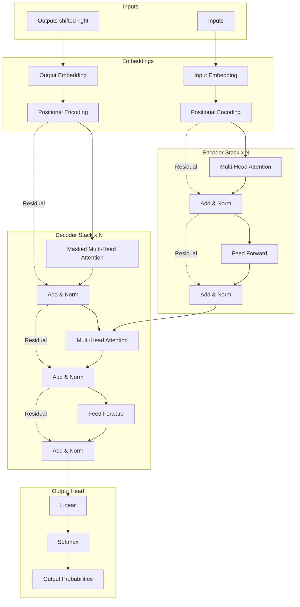
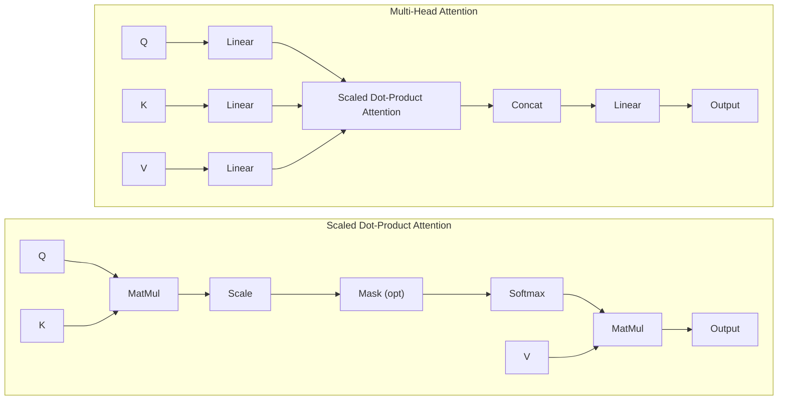

Attention Is All You Need (어텐션이 전부다)
원문과 번역, 어휘 설명
원재
2017 Attention Is All You Need
Ashish Vaswani, Noam Shazeer, Niki Parmar, Jakob Uszkoreit, Llion Jones, Aidan N. Gomez, Lukasz Kaiser, Illia Polosukhin
Google Brain / Google Research / University of Toronto
arXiv:1706.03762
읽기 전에: 핵심 개념
시퀀스 변환(sequence transduction)
시퀀스 변환은 한 시퀀스(예: 원문 문장)를 다른 시퀀스(예: 번역 문장)로 바꾸는 작업을 말합니다. 기계 번역, 요약, 질의응답 등이 여기에 해당합니다. 기존에는 RNN과 LSTM으로 인코더-디코더를 구성하고, 그 사이에 어텐션(attention)을 두는 방식이 널리 쓰였습니다.

트랜스포머(Transformer)
본 논문에서 제안하는 트랜스포머는 순환(recurrence)과 합성곱(convolution)을 사용하지 않고, 어텐션만으로 인코더와 디코더를 구성한 구조인데요. 한 번에 모든 위치를 볼 수 있어 병렬화가 용이하고 학습 시간도 짧습니다. BERT는 이 트랜스포머의 인코더만 쌓아 사용하는 모델입니다.

셀프 어텐션(self-attention)
셀프 어텐션은 한 시퀀스 내 서로 다른 위치들을 서로 참조하여 그 시퀀스의 표현을 계산하는 어텐션입니다. 말하자면, 같은 문장 안에서 각 단어가 다른 단어들을 참고해 가중합을 구하는 방식이라고 이해하시면 됩니다.

Abstract (초록)
원문
The dominant sequence transduction models are based on complex recurrent or convolutional neural networks that include an encoder and a decoder. The best performing models also connect the encoder and decoder through an attention mechanism. We propose a new simple network architecture, the Transformer, based solely on attention mechanisms, dispensing with recurrence and convolutions entirely. Experiments on two machine translation tasks show these models to be superior in quality while being more parallelizable and requiring significantly less time to train. Our model achieves 28.4 BLEU on the WMT 2014 English-to-German translation task, improving over the existing best results, including ensembles, by over 2 BLEU. On the WMT 2014 English-to-French translation task, our model establishes a new single-model state-of-the-art BLEU score of 41.8 after training for 3.5 days on eight GPUs, a small fraction of the training costs of the best models from the literature. We show that the Transformer generalizes well to other tasks by applying it successfully to English constituency parsing both with large and limited training data.

번역
주요 시퀀스 변환(sequence transduction) 모델은 인코더와 디코더를 포함한 순환(recurrent) 또는 합성곱(convolutional) 신경망에 기반합니다. 성능이 뛰어난 모델들은 인코더와 디코더를 어텐션(attention) 메커니즘으로 연결합니다. 본 논문에서는 순환과 합성곱을 완전히 제거하고, 어텐션만으로 동작하는 새로운 네트워크 구조인 트랜스포머(Transformer)를 제안합니다. 두 가지 기계 번역 과제에서 이 모델은 품질이 우수할 뿐 아니라 병렬화가 잘 되며 학습 시간도 크게 단축됩니다. WMT 2014 영-독 번역에서 28.4 BLEU를 달성하여, 앙상블을 포함한 기존 최고 성능을 2 BLEU 이상 상회했습니다. WMT 2014 영-불 번역에서는 GPU 8대로 3.5일 학습한 단일 모델로 41.8 BLEU라는 당시 단일 모델 최고 성적을 기록했으며, 문헌에 보고된 최고 모델 대비 학습 비용은 훨씬 적습니다. 트랜스포머는 영어 성분 구문 분석(English constituency parsing)에도 대량 및 소량 훈련 데이터 모두에서 성공적으로 적용되어, 다른 과제로의 일반화가 잘 됨을 보여 줍니다.

1. Introduction (서론)
원문
Recurrent neural networks, long short-term memory [13] and gated recurrent [7] neural networks in particular, have been firmly established as state of the art approaches in sequence modeling and transduction problems such as language modeling and machine translation [35, 2, 5]. Numerous efforts have since continued to push the boundaries of recurrent language models and encoder-decoder architectures [38, 24, 15].

Recurrent models typically factor computation along the symbol positions of the input and output sequences. Aligning the positions to steps in computation time, they generate a sequence of hidden states h_t, as a function of the previous hidden state h_{t-1} and the input for position t. This inherently sequential nature precludes parallelization within training examples, which becomes critical at longer sequence lengths, as memory constraints limit batching across examples. Recent work has achieved significant improvements in computational efficiency through factorization tricks [21] and conditional computation [32], while also improving model performance in case of the latter. The fundamental constraint of sequential computation, however, remains.

Attention mechanisms have become an integral part of compelling sequence modeling and transduction models in various tasks, allowing modeling of dependencies without regard to their distance in the input or output sequences [2, 19]. In all but a few cases [27], however, such attention mechanisms are used in conjunction with a recurrent network.

In this work we propose the Transformer, a model architecture eschewing recurrence and instead relying entirely on an attention mechanism to draw global dependencies between input and output. The Transformer allows for significantly more parallelization and can reach a new state of the art in translation quality after being trained for as little as twelve hours on eight P100 GPUs.

번역
순환 신경망(recurrent neural network), 특히 LSTM[1]과 GRU[2]는 언어 모델링과 기계 번역[3] 같은 시퀀스 모델링 및 변환 과제에서 최첨단 방법으로 널리 쓰이고 있습니다. 그 후 순환 언어 모델과 인코더-디코더 구조의 한계를 넓히려는 연구가 이어졌습니다[4].

순환 모델은 일반적으로 입력·출력 시퀀스의 심볼 위치를 계산 시간의 스텝에 맞춰, 이전 은닉 상태 h_{t-1}와 위치 t의 입력으로부터 h_t를 순차적으로 생성합니다. 이러한 본질적으로 순차적인 특성 때문에 훈련 샘플 내부에서는 병렬화가 불가능하고, 시퀀스가 길어질수록 메모리 제약으로 배치 크기도 제한됩니다.

최근 인수 분해 기법[5]과 조건부 계산(conditional computation)[6]을 통해 계산 효율을 크게 높인 연구가 있는데요, 후자의 경우 모델 성능도 개선되었습니다. 그럼에도 순차 계산이라는 근본적인 제약은 여전히 남아 있습니다.

어텐션 메커니즘은 다양한 과제에서 시퀀스 모델링 및 변환 모델의 핵심 구성 요소가 되었으며, 입력·출력 시퀀스 내 거리와 무관하게 의존 관계를 모델링할 수 있게 합니다[7]. 다만 대부분의 경우[8] 이러한 어텐션은 순환 네트워크와 함께 사용됩니다.

본 논문에서는 순환을 사용하지 않고, 입력과 출력 간 전역 의존 관계를 어텐션만으로 학습하는 트랜스포머를 제안합니다. 트랜스포머는 병렬화가 훨씬 용이해서, P100 GPU 8대로 12시간만 훈련해도 번역 품질에서 새로운 최고 수준에 도달할 수 있습니다.

2. Background (배경)
원문
The goal of reducing sequential computation also forms the foundation of the Extended Neural GPU [16], ByteNet [18] and ConvS2S [9], all of which use convolutional neural networks as basic building block, computing hidden representations in parallel for all input and output positions. In these models, the number of operations required to relate signals from two arbitrary input or output positions grows in the distance between positions, linearly for ConvS2S and logarithmically for ByteNet. This makes it more difficult to learn dependencies between distant positions [12]. In the Transformer this is reduced to a constant number of operations, albeit at the cost of reduced effective resolution due to averaging attention-weighted positions, an effect we counteract with Multi-Head Attention as described in section 3.2.

Self-attention, sometimes called intra-attention is an attention mechanism relating different positions of a single sequence in order to compute a representation of the sequence. Self-attention has been used successfully in a variety of tasks including reading comprehension, abstractive summarization, textual entailment and learning task-independent sentence representations [4, 27, 28, 22].
End-to-end memory networks are based on a recurrent attention mechanism instead of sequence-aligned recurrence and have been shown to perform well on simple-language question answering and language modeling tasks [34].
To the best of our knowledge, however, the Transformer is the first transduction model relying entirely on self-attention to compute representations of its input and output without using sequence-aligned RNNs or convolution.
In the following sections, we will describe the Transformer, motivate self-attention and discuss its advantages over models such as [17], [18] and [9].

번역
순차 계산을 줄이려는 목표는 Extended Neural GPU[9], ByteNet[10], ConvS2S[11]의 기반이기도 합니다. 이 모델들은 모두 합성곱 신경망(convolutional neural network)을 기본 구성 요소로 사용하며, 모든 입력·출력 위치에 대해 은닉 표현을 병렬로 계산합니다. 이들 모델에서는 두 임의 위치의 신호를 연결하는 데 필요한 연산 수가 위치 간 거리에 따라 증가하는데요, ConvS2S는 선형적으로, ByteNet은 로그에 비례합니다. 따라서 먼 거리 간 의존 관계를 학습하기가 더 어렵습니다[12]. 트랜스포머에서는 이 연산 수가 상수로 줄어듭니다. 다만 어텐션으로 가중 평균을 취하면서 유효 해상도가 낮아지는 효과가 있어서, 3.2절에서 설명하는 멀티헤드 어텐션(multi-head attention)으로 보완합니다. 해당 절은 나중에 자세히 참고하세요.

셀프 어텐션(self-attention, 내부 어텐션(intra-attention)이라고도 합니다)은 한 시퀀스의 서로 다른 위치들을 서로 참조하여 그 시퀀스의 표현을 계산하는 어텐션 메커니즘입니다. 독해, 추상적 요약, 텍스트 함의, 과제 독립적 문장 표현 학습 등 다양한 과제에서 성공적으로 사용되었습니다[13].

End-to-end 메모리 네트워크는 시퀀스에 정렬된 순환 대신 순환적 어텐션에 기반하며, 단순 질의응답 및 언어 모델링 과제에서 좋은 성능을 보입니다[14].

저자들이 아는 한, 트랜스포머는 시퀀스 정렬 RNN이나 합성곱 없이 전적으로 셀프 어텐션만으로 입력·출력의 표현을 계산하는 최초의 변환(transduction) 모델입니다.

이어지는 절에서 트랜스포머를 설명하고, 셀프 어텐션을 채택한 동기와 [17], [18], [9]와 같은 모델 대비 장점을 논합니다.

3. Model Architecture (모델 구조)
원문
Most competitive neural sequence transduction models have an encoder-decoder structure [5, 2, 35]. Here, the encoder maps an input sequence of symbol representations (x_1, ..., x_n) to a sequence of continuous representations z = (z_1, ..., z_n). Given z, the decoder then generates an output sequence (y_1, ..., y_m) of symbols one element at a time. At each step the model is auto-regressive [10], consuming the previously generated symbols as additional input when generating the next. The Transformer follows this overall architecture using stacked self-attention and point-wise, fully connected layers for both the encoder and decoder, shown in the left and right halves of Figure 1, respectively.

번역
대부분의 경쟁력 있는 신경 시퀀스 변환 모델은 인코더-디코더 구조[5, 2, 35]를 따릅니다. 여기서 인코더는 심볼 표현의 입력 시퀀스 (x_1, ..., x_n)을 연속적인 표현의 시퀀스 z = (z_1, ..., z_n)으로 매핑합니다. z가 주어지면, 디코더는 출력 시퀀스 (y_1, ..., y_m)를 한 번에 한 원소씩 생성합니다. 각 단계에서 모델은 자기회귀(auto-regressive)[10] 방식을 따르며, 이전에 생성된 심볼들을 다음 심볼 생성 시 추가 입력으로 사용합니다. 트랜스포머는 이러한 전체적인 아키텍처를 따르되, 인코더와 디코더 모두에 스택된 셀프 어텐션(self-attention)과 위치별 완전연결층(point-wise fully connected layer)을 사용합니다. 이는 각각 그림 1의 왼쪽과 오른쪽 부분에 나타나 있습니다.

> **참고: "스택된(stacked)"의 의미**
> 여기서 '스택된'이란 동일한 구조의 레이어(Layer)를 여러 개(논문에서는 N=6) 겹쳐서 쌓아 올렸다는 뜻입니다. RNN처럼 시간 순서대로 반복하는 것이 아니라, 서로 다른 파라미터를 가진 6개의 층을 수직으로 통과하며 정보를 점진적으로 처리합니다. (마치 6명의 전문가가 단계별로 문장을 다듬는 것과 유사합니다.)

### Architecture Diagram (Mermaid)

### Architecture Summary (Table)

| Layer / Component | Encoder (인코더) | Decoder (디코더) |
| :--- | :--- | :--- |
| **Input** | Input Symbols (Inputs) | Output Symbols (Shifted Right) |
| **Embedding** | Input Embedding + Positional Encoding | Output Embedding + Positional Encoding |
| **Sub-layer 1** | Multi-Head Self-Attention | Masked Multi-Head Self-Attention |
| | + Add & Norm | + Add & Norm |
| **Sub-layer 2** | Feed Forward | Multi-Head Attention (Encoder-Decoder) |
| | + Add & Norm | + Add & Norm |
| **Sub-layer 3** | (None) | Feed Forward |
| | | + Add & Norm |
| **Output** | To Decoder Attention Layers | Linear -> Softmax -> Probabilities |

### 구조 상세 설명

**1. 인코더(Encoder)**
인코더는 **N=6** 개의 동일한 레이어가 쌓인 형태입니다. 각 레이어는 **2개의 서브 레이어(Sub-layer)** 로 구성됩니다.
1. **Multi-Head Self-Attention**: 입력 문장 내의 단어들끼리 서로 참조하여 문맥을 파악합니다.
2. **Position-wise Feed-Forward Network**: 각 위치별로 독립적인 완전연결층을 거칩니다.

**2. 디코더(Decoder)**
디코더도 **N=6** 개의 동일한 레이어로 구성되지만, 인코더와 달리 각 레이어에 **3개의 서브 레이어**가 있습니다.
1. **Masked Multi-Head Self-Attention**: 디코더 입력(이전에 생성된 단어들)을 처리합니다. 이때 미래의 단어를 미리 보지 못하도록 마스킹(Masking)을 적용합니다.
2. **Multi-Head Attention (Encoder-Decoder Attention)**: 인코더의 출력값(Key, Value)과 디코더의 현재 상태(Query)를 연결하여, 입력 문장의 어느 부분에 집중해야 할지 계산합니다. (이 층이 인코더에 없는 추가된 부분입니다.)
3. **Position-wise Feed-Forward Network**: 인코더와 동일한 형태의 신경망입니다.

모든 서브 레이어 다음에는 **잔차 연결(Residual Connection)** 과 **층 정규화(Layer Normalization)** 가 수행됩니다. 즉, 각 서브 레이어의 출력은 `LayerNorm(x + Sublayer(x))` 형태가 됩니다. 

The Transformer follows this overall architecture using stacked self-attention and point-wise, fully
connected layers for both the encoder and decoder, shown in the left and right halves of Figure 1,
respectively.

3.1 Encoder and Decoder Stacks (인코더·디코더 스택)
원문
**Encoder:** The encoder is composed of a stack of N=6 identical layers. Each layer has two sub-layers. The first is a multi-head self-attention mechanism, and the second is a simple, position-wise fully connected feed-forward network. We employ a residual connection [11] around each of the two sub-layers, followed by layer normalization [1]. That is, the output of each sub-layer is LayerNorm(x + Sublayer(x)), where Sublayer(x) is the function implemented by the sub-layer itself. To facilitate these residual connections, all sub-layers in the model, as well as the embedding layers, produce outputs of dimension d_model = 512.

**Decoder:** The decoder is also composed of a stack of N=6 identical layers. In addition to the two sub-layers in each encoder layer, the decoder inserts a third sub-layer, which performs multi-head attention over the output of the encoder stack. Similar to the encoder, we employ residual connections around each of the sub-layers, followed by layer normalization. We also modify the self-attention sub-layer in the decoder stack to prevent positions from attending to subsequent positions. This masking, combined with fact that the output embeddings are offset by one position, ensures that the predictions for position i can depend only on the known outputs at positions less than i.

번역
**인코더(Encoder):** 인코더는 **N=6** 개의 동일한 레이어로 구성된 스택입니다. 각 레이어에는 두 개의 서브 레이어(sub-layer)가 있습니다. 첫 번째는 멀티헤드 셀프 어텐션(multi-head self-attention) 메커니즘이고, 두 번째는 단순한 위치별 완전연결 피드포워드 네트워크(position-wise fully connected feed-forward network)입니다. 두 서브 레이어 각각의 주변에는 잔차 연결(residual connection)[11]을 적용하고, 그 뒤에 층 정규화(layer normalization)[1]를 수행합니다. 즉, 각 서브 레이어의 출력은 **LayerNorm(x + Sublayer(x))**가 됩니다. 여기서 Sublayer(x)는 해당 서브 레이어가 구현하는 함수입니다. 이러한 잔차 연결을 원활히 하기 위해, 모델의 모든 서브 레이어와 임베딩 층은 **d_model = 512** 차원의 출력을 생성합니다.

**디코더(Decoder):** 디코더 역시 **N=6** 개의 동일한 레이어 스택으로 구성됩니다. 인코더 레이어에 있는 두 서브 레이어 외에도, 디코더는 인코더 스택의 출력을 대상으로 멀티헤드 어텐션을 수행하는 세 번째 서브 레이어를 삽입합니다. 인코더와 마찬가지로 각 서브 레이어 주변에 잔차 연결을 적용하고 층 정규화를 수행합니다. 또한, 디코더 스택의 셀프 어텐션 서브 레이어를 수정하여, 현재 위치보다 뒤에 있는 위치(미래의 정보)를 참조하지 못하도록 합니다. 이러한 마스킹(masking)과 출력 임베딩이 한 위치씩 뒤로 밀려 있다는 사실(offset by one position)을 결합하여, 위치 i에 대한 예측이 i보다 작은 위치의 미리 알고 있는 출력들에만 의존하도록 보장합니다.

3.2 Attention (어텐션)
원문
An attention function can be described as mapping a query and a set of key-value pairs to an output, where the query, keys, values, and output are all vectors. The output is computed as a weighted sum of the values, where the weight assigned to each value is computed by a compatibility function of the query with the corresponding key.

번역
어텐션 함수는 쿼리(query)와 키-값 쌍(key-value pairs) 집합을 출력으로 매핑하는 것으로 설명할 수 있습니다. 여기서 쿼리, 키, 값, 출력은 모두 벡터입니다. 출력은 값들의 가중합으로 계산되며, 각 값에 할당되는 가중치는 쿼리와 해당 키의 호환 함수(compatibility function)에 의해 계산됩니다.

### Figure 2: Attention Mechanisms

**그림 2: (위) 병렬로 실행되는 여러 어텐션 레이어로 구성된 멀티헤드 어텐션(Multi-Head Attention). (아래) 스케일된 내적 어텐션(Scaled Dot-Product Attention)**

3.2.1 Scaled Dot-Product Attention (스케일된 내적 어텐션)
원문
We call our particular attention "Scaled Dot-Product Attention" (Figure 2). The input consists of queries and keys of dimension $d_k$, and values of dimension $d_v$. We compute the dot products of the query with all keys, divide each by $\sqrt{d_k}$, and apply a softmax function to obtain the weights on the values.

In practice, we compute the attention function on a set of queries simultaneously, packed together into a matrix $Q$. The keys and values are also packed together into matrices $K$ and $V$. We compute the matrix of outputs as:

$$ \text{Attention}(Q, K, V) = \text{softmax}\left(\frac{QK^T}{\sqrt{d_k}}\right)V $$

The two most commonly used attention functions are additive attention [2], and dot-product (multiplicative) attention. Dot-product attention is identical to our algorithm, except for the scaling factor of $1/\sqrt{d_k}$. Additive attention computes the compatibility function using a feed-forward network with a single hidden layer. While the two are similar in theoretical complexity, dot-product attention is much faster and more space-efficient in practice, since it can be implemented using highly optimized matrix multiplication code.

While for small values of $d_k$ the two mechanisms perform similarly, additive attention outperforms dot product attention without scaling for larger values of $d_k$ [3]. We suspect that for large values of $d_k$, the dot products grow large in magnitude, pushing the softmax function into regions where it has extremely small gradients [4]. To counteract this effect, we scale the dot products by $1/\sqrt{d_k}$.

번역
우리는 이 어텐션을 "스케일된 내적 어텐션(Scaled Dot-Product Attention)"이라고 부릅니다(그림 2). 입력은 차원 $d_k$의 쿼리와 키, 그리고 차원 $d_v$의 값들로 구성됩니다. 쿼리와 모든 키의 내적을 계산하고, 이를 $\sqrt{d_k}$로 나눈 뒤, softmax 함수를 적용하여 값들에 대한 가중치를 얻습니다.

실제로는 쿼리 집합에 대해 동시에 어텐션 함수를 계산하며, 이를 행렬 $Q$로 묶습니다. 키와 값들도 각각 행렬 $K$와 $V$로 묶습니다. 출력 행렬은 다음과 같이 계산됩니다:

$$ \text{Attention}(Q, K, V) = \text{softmax}\left(\frac{QK^T}{\sqrt{d_k}}\right)V $$

가장 널리 쓰이는 두 가지 어텐션 함수는 가산 어텐션(additive attention)[2]과 내적(dot-product, 승산) 어텐션입니다. 내적 어텐션은 스케일링 인자 $1/\sqrt{d_k}$를 제외하면 우리 알고리즘과 동일합니다. 가산 어텐션은 단일 은닉층을 가진 피드포워드 네트워크를 사용하여 호환 함수를 계산합니다. 두 방식은 이론적 복잡도는 비슷하지만, 내적 어텐션이 고도로 최적화된 행렬 곱셈 코드로 구현할 수 있어 실제로는 훨씬 빠르고 메모리 효율적입니다.

$d_k$ 값이 작을 때는 두 메커니즘의 성능이 비슷하지만, $d_k$가 클 때는 스케일링 없는 내적 어텐션보다 가산 어텐션의 성능이 더 좋습니다[3]. 우리는 $d_k$가 커지면 내적 값의 크기가 커져서 softmax 함수를 기울기(gradient)가 매우 작은 영역으로 밀어 넣기 때문이라고 추측합니다[4]. 이러한 효과를 상쇄하기 위해 내적 값을 $1/\sqrt{d_k}$로 스케일링합니다.

3.2.2 Multi-Head Attention (멀티헤드 어텐션)
원문
Instead of performing a single attention function with $d_{model}$-dimensional keys, values and queries, we found it beneficial to linearly project the queries, keys and values $h$ times with different, learned linear projections to $d_k$, $d_k$ and $d_v$ dimensions, respectively. On each of these projected versions of queries, keys and values we then perform the attention function in parallel, yielding $d_v$-dimensional output values. These are concatenated and once again projected, resulting in the final values, as depicted in Figure 2.

Multi-head attention allows the model to jointly attend to information from different representation subspaces at different positions. With a single attention head, averaging inhibits this.

$$ \text{MultiHead}(Q, K, V) = \text{Concat}(\text{head}_1, \dots, \text{head}_h)W^O $$

where $\text{head}_i = \text{Attention}(QW_i^Q, KW_i^K, VW_i^V)$

Where the projections are parameter matrices $W_i^Q \in \mathbb{R}^{d_{model} \times d_k}$, $W_i^K \in \mathbb{R}^{d_{model} \times d_k}$, $W_i^V \in \mathbb{R}^{d_{model} \times d_v}$ and $W^O \in \mathbb{R}^{hd_v \times d_{model}}$.

In this work we employ $h=8$ parallel attention layers, or heads. For each of these we use $d_k = d_v = d_{model}/h = 64$. Due to the reduced dimension of each head, the total computational cost is similar to that of single-head attention with full dimensionality.

번역
$d_{model}$ 차원의 키, 값, 쿼리로 단일 어텐션 함수를 수행하는 대신, 우리는 쿼리, 키, 값을 서로 다른 학습된 선형 투영(linear projection)을 통해 각각 $d_k$, $d_k$, $d_v$ 차원으로 $h$번 선형 투영하는 것이 유익하다는 것을 발견했습니다. 이렇게 투영된 쿼리, 키, 값 버전들 각각에 대해 어텐션 함수를 병렬로 수행하여 $d_v$ 차원의 출력 값들을 얻습니다. 이들은 연결(concatenated)되고 다시 한 번 투영되어 최종 값을 생성합니다(그림 2 참조).

멀티헤드 어텐션은 모델이 서로 다른 위치에 있는 서로 다른 표현 부분공간(representation subspaces)의 정보에 결합적으로 집중(attend)할 수 있게 해줍니다. 단일 어텐션 헤드만 사용할 경우, 평균화(averaging) 과정이 이를 방해합니다.

$$ \text{MultiHead}(Q, K, V) = \text{Concat}(\text{head}_1, \dots, \text{head}_h)W^O $$

여기서 $\text{head}_i = \text{Attention}(QW_i^Q, KW_i^K, VW_i^V)$ 입니다.

각 투영(projection)은 학습된 파라미터 행렬 $W_i^Q \in \mathbb{R}^{d_{model} \times d_k}$, $W_i^K \in \mathbb{R}^{d_{model} \times d_k}$, $W_i^V \in \mathbb{R}^{d_{model} \times d_v}$ 및 $W^O \in \mathbb{R}^{hd_v \times d_{model}}$입니다.

본 논문에서는 $h=8$개의 병렬 어텐션 층(헤드)을 사용합니다. 각 헤드에 대해 $d_k = d_v = d_{model}/h = 64$를 사용합니다. 각 헤드의 차원이 줄어들었기 때문에, 전체 계산 비용은 전체 차원을 가진 단일 헤드 어텐션과 비슷합니다.

3.2.3 Applications of Attention in our Model (모델에서의 어텐션 사용)
트랜스포머는 멀티헤드 어텐션을 세 가지 방식으로 사용합니다.

인코더-디코더 어텐션: 쿼리는 이전 디코더 층에서, 메모리 키와 값은 인코더 출력에서 옵니다. 이렇게 하면 디코더의 모든 위치가 입력 시퀀스의 모든 위치를 참고할 수 있으며, seq2seq 모델에서 흔히 쓰는 인코더-디코더 어텐션[21]과 동일한 역할을 합니다.
인코더 셀프 어텐션: 키, 값, 쿼리 모두 같은 소스(인코더의 이전 층 출력)에서 옵니다. 인코더의 각 위치는 인코더 이전 층의 모든 위치를 참고할 수 있습니다.
디코더 셀프 어텐션: 디코더의 셀프 어텐션에서는 각 위치가 그 위치 이전의 디코더 위치만 참고할 수 있도록 합니다. 자기회귀 특성을 유지하려면 이후 위치로의 정보 유출을 막아야 하므로, 스케일된 내적 어텐션 내부에서 허용되지 않는 연결에 해당하는 softmax 입력을 마스킹(
−
∞
−∞로 설정)합니다.
3.3 Position-wise Feed-Forward Networks (위치별 피드포워드 네트워크)
원문
In addition to attention sub-layers, each layer in the encoder and decoder contains a fully connected feed-forward network, applied to each position separately and identically. This consists of two linear transformations with a ReLU activation in between:

F
F
N
(
x
)
=
max
⁡
(
0
,
x
W
1
+
b
1
)
W
2
+
b
2
FFN(x)=max(0,xW 
1
​
 +b 
1
​
 )W 
2
​
 +b 
2
​
 

The dimensionality of input and output is 
d
m
o
d
e
l
=
512
d 
model
​
 =512, and the inner-layer has dimensionality 
d
f
f
=
2048
d 
ff
​
 =2048.

번역
어텐션 서브층에 더해, 인코더와 디코더의 각 층에는 완전연결 피드포워드 네트워크(fully connected feed-forward network)가 포함됩니다. 이 네트워크는 각 위치에 개별적으로, 동일한 방식으로 적용됩니다. 두 개의 선형 변환과 그 사이의 ReLU 활성화 함수로 구성되는데요, 수식은 다음과 같습니다.

F
F
N
(
x
)
=
max
⁡
(
0
,
x
W
1
+
b
1
)
W
2
+
b
2
FFN(x)=max(0,xW 
1
​
 +b 
1
​
 )W 
2
​
 +b 
2
​
 

입력·출력 차원은 
d
m
o
d
e
l
=
512
d 
model
​
 =512이며, 내부층 차원은 
d
f
f
=
2048
d 
ff
​
 =2048입니다.

3.4 Embeddings and Softmax (임베딩과 Softmax)
다른 시퀀스 변환 모델과 마찬가지로, 학습된 임베딩(learned embedding)을 사용해 입력·출력 토큰을 
d
m
o
d
e
l
d 
model
​
  차원 벡터로 변환합니다. 디코더 출력을 다음 토큰 확률로 변환하기 위해 학습된 선형 변환과 softmax 함수를 사용합니다. [30]과 같이 두 임베딩 층과 softmax 직전 선형 변환에서 동일한 가중치 행렬을 공유하며, 임베딩 층에서는 해당 가중치에 
d
m
o
d
e
l
d 
model
​
 
​
 을 곱합니다. 원 논문 참고문헌 [30]을 참고하세요.

3.5 Positional Encoding (위치 인코딩)
모델에 순환과 합성곱이 없기 때문에, 시퀀스의 순서 정보를 활용하려면 토큰의 상대 또는 절대 위치 정보를 주입해야 합니다. 이를 위해 인코더와 디코더 스택의 맨 아래, 입력 임베딩에 위치 인코딩(positional encoding)을 더합니다. 위치 인코딩의 차원은 임베딩과 동일한 
d
m
o
d
e
l
d 
model
​
 이므로 단순히 더할 수 있습니다. 위치 인코딩에는 학습된 것과 고정된 것 등 여러 선택이 있는데요[22], 본 논문에서는 서로 다른 주파수의 사인·코사인 함수를 사용합니다.

P
E
(
p
o
s
,
2
i
)
=
sin
⁡
(
p
o
s
/
10000
2
i
/
d
m
o
d
e
l
)
,
P
E
(
p
o
s
,
2
i
+
1
)
=
cos
⁡
(
p
o
s
/
10000
2
i
/
d
m
o
d
e
l
)
PE 
(pos,2i)
​
 =sin(pos/10000 
2i/d 
model
​
 
 ),PE 
(pos,2i+1)
​
 =cos(pos/10000 
2i/d 
model
​
 
 )

여기서 
p
o
s
pos는 위치, 
i
i는 차원 인덱스입니다. 학습된 위치 임베딩[22:1]으로도 실험했으며, 두 방식의 결과는 거의 동일했습니다. 사인/코사인 방식을 선택한 이유는 훈련 시 사용한 것보다 긴 시퀀스에 대한 외삽(extrapolation)이 가능할 수 있기 때문입니다.

4. Why Self-Attention (왜 셀프 어텐션인가)
이 절에서는 
(
x
1
,
…
,
x
n
)
(x 
1
​
 ,…,x 
n
​
 )을 
(
z
1
,
…
,
z
n
)
(z 
1
​
 ,…,z 
n
​
 )으로 사상할 때 셀프 어텐션 층을 순환·합성곱 층과 다음 세 가지 측면에서 비교합니다. (1) 층당 총 계산 복잡도, (2) 병렬화 가능한 연산량(필요한 순차 연산의 최소 횟수), (3) 장거리 의존 관계를 학습하기까지의 경로 길이입니다. 장거리 의존 관계 학습은 시퀀스 변환의 핵심 과제인데요, 신호가 통과해야 하는 경로가 짧을수록 학습이 용이합니다[23]. 트랜스포머에서는 셀프 어텐션으로 이 경로 길이가 상수가 됩니다. 순환층은 
O
(
n
)
O(n)의 순차 연산이 필요하지만, 셀프 어텐션은 
O
(
1
)
O(1)입니다. 시퀀스 길이 
n
n이 표현 차원 
d
d보다 작은 경우가 많은데(예: word-piece[24], byte-pair[25] 표현), 이때 셀프 어텐션 층이 순환층보다 계산상 더 빠릅니다. 매우 긴 시퀀스에서는 셀프 어텐션을 반경 
r
r 이내로 제한하는 제한된 셀프 어텐션(restricted self-attention)을 사용할 수 있으며, 이때 최대 경로 길이는 
O
(
n
/
r
)
O(n/r)이 됩니다. 합성곱은 커널 폭 
k
<
n
k<n이면 한 층으로는 모든 입출력 위치 쌍을 연결하지 못하고, dilated convolution[26]을 사용하면 
O
(
log
⁡
k
(
n
)
)
O(log 
k
​
 (n)) 개의 층이 필요합니다. 부가적으로 셀프 어텐션은 해석 가능한(interpretable) 모델을 만드는 데 도움이 되며, 논문 부록에서 어텐션 분포 예시를 제시합니다. 부록도 한번 참고하세요.

5. Training (학습) 요약
데이터: WMT 2014 영-독(약 450만 문장 쌍), 영-불(3,600만 문장) 데이터셋을 사용했습니다. 영-독은 byte-pair encoding[27], 영-불은 word-piece[24:1] 어휘(각각 약 37K, 32K 토큰)를 사용했는데요, 문장 쌍을 대략적인 시퀀스 길이로 묶어 한 배치에 약 25K 원문 토큰과 25K 번역문 토큰이 포함되도록 했습니다.
하드웨어 및 일정: NVIDIA P100 GPU 8대로 훈련했습니다. base 모델은 10만 스텝(약 12시간), big 모델은 30만 스텝(3.5일) 훈련했습니다.
옵티마이저: Adam[28] (
β
1
=
0.9
β 
1
​
 =0.9, 
β
2
=
0.98
β 
2
​
 =0.98, 
ϵ
=
10
−
9
ϵ=10 
−9
 )을 사용했습니다. 학습률은 warmup 4,000 스텝까지 선형적으로 증가시킨 뒤, 스텝 수의 역제곱근에 비례하여 감소시켰습니다.
정규화: 각 서브층 출력과 임베딩·위치 인코딩의 합에 dropout[29](비율 0.1)을 적용했습니다. 라벨 스무딩(label smoothing)[30] 
ϵ
l
s
=
0.1
ϵ 
ls
​
 =0.1을 사용했으며, perplexity는 다소 나빠지지만 정확도와 BLEU는 개선되었습니다.
6. Results (결과) 요약
WMT 2014 영-독: big 트랜스포머가 28.4 BLEU를 달성하여, 앙상블을 포함한 기존 최고 성능 대비 2 BLEU 이상 향상되었습니다. base 모델만으로도 기존 단일·앙상블 모델을 모두 상회했으며, 훈련 비용은 훨씬 적었습니다.
WMT 2014 영-불: big 모델이 41.8 BLEU(단일 모델 최고 성적)를 기록했습니다. 이전 최고 단일 모델 대비 훈련 비용은 1/4 미만이었습니다.
영어 성분 구문 분석: 대량 및 제한된 훈련 데이터 모두에서 트랜스포머를 성공적으로 적용했습니다.
어휘/숙어 설명
원문	한글	의미
sequence transduction	시퀀스 변환	한 시퀀스를 다른 시퀀스로 변환하는 작업(번역, 요약 등)을 말합니다.
recurrent / recurrence	순환(적)	이전 스텝의 결과에 의존하는 반복 구조입니다.
encoder-decoder	인코더-디코더	입력을 표현으로 압축하는 인코더와, 그 표현으로부터 출력을 생성하는 디코더로 구성된 구조입니다.
attention	어텐션	쿼리·키·값을 이용해 가중합으로 출력을 계산하는 메커니즘입니다.
self-attention / intra-attention	셀프 어텐션 / 내부 어텐션	한 시퀀스 내 위치들을 서로 참조하는 어텐션입니다.
parallelization	병렬화	여러 위치 또는 스텝을 동시에 계산하는 것을 말합니다.
residual connection	잔차 연결	
x
+
S
u
b
l
a
y
e
r
(
x
)
x+Sublayer(x)처럼 입력을 더해 주는 연결입니다.
layer normalization	레이어 정규화	한 층의 출력을 정규화하여 학습을 안정화하는 기법입니다.
scaled dot-product attention	스케일된 내적 어텐션	
s
o
f
t
m
a
x
(
Q
K
T
/
d
k
)
V
softmax(QK 
T
 / 
d 
k
​
 
​
 )V 형태의 어텐션입니다.
multi-head attention	멀티헤드 어텐션	여러 개의 어텐션을 병렬로 수행한 뒤 이어 붙이는 구조입니다.
position-wise	위치별	각 위치에 동일한 연산을 개별적으로 적용하는 것을 말합니다.
positional encoding	위치 인코딩	토큰의 위치 정보를 벡터로 더해 주는 것입니다.
auto-regressive	자기회귀	이전에 생성한 심볼을 입력으로 사용해 다음 심볼을 생성하는 방식입니다.
masking	마스킹	특정 위치를 참조하지 못하도록 가리는 것을 말합니다.
원 논문의 참고문헌 번호 [1]–[39]는 논문 본문의 참고문헌 목록을 참조하시면 됩니다. 위 각주는 대표적인 선행 연구만 표기한 것입니다.

Hochreiter & Schmidhuber, 1997 (LSTM) ↩︎

Cho et al., 2014 (GRU) ↩︎

Sutskever et al., 2014; Bahdanau et al., 2015; Kalchbrenner et al., 2016 등 ↩︎

Wu et al., 2016; Luong et al., 2015; Bahdanau et al., 2015 등 ↩︎

Kaiser & Bengio, 2016 등 ↩︎

Shazeer et al., 2017 (MoE 등) ↩︎

Bahdanau et al., 2015; Luong et al., 2015 ↩︎

Cheng et al., 2016 등 (self-attention만 쓰는 소수 예외) ↩︎

Kaiser et al., 2016 (Extended Neural GPU) ↩︎

Kalchbrenner et al., 2016 (ByteNet) ↩︎

Gehring et al., 2017 (ConvS2S) ↩︎

Hochreiter, 1991; Bengio et al., 1994 (long-range 의존성) ↩︎

Cheng et al., 2016; Cheng et al., 2016; Parikh et al., 2016; Lin et al., 2017 ↩︎

Sukhbaatar et al., 2015 ↩︎

Sutskever et al., 2014; Bahdanau et al., 2015; Kalchbrenner et al., 2016 ↩︎

Graves, 2013 ↩︎

He et al., 2016 (residual connection) ↩︎

Ba et al., 2016 (layer normalization) ↩︎

Bahdanau et al., 2015 ↩︎

Luong et al., 2015 ↩︎

Wu et al., 2016; Bahdanau et al., 2015; Gehring et al., 2017 ↩︎

Gehring et al., 2017 (ConvS2S) ↩︎ ↩︎

Hochreiter, 1991; Bengio et al., 1994 ↩︎

Wu et al., 2016 (GNMT) ↩︎ ↩︎

Sennrich et al., 2016 (BPE) ↩︎

Kalchbrenner et al., 2016 (ByteNet, dilated convolution) ↩︎

Sennrich et al., 2016 ↩︎

Kingma & Ba, 2015 ↩︎

Srivastava et al., 2014 ↩︎

Szegedy et al., 2016 ↩︎c